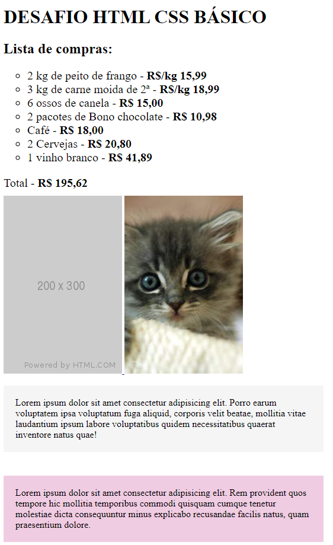

# Desafio HTML + CSS Básico
## (Atualizado) - 30/05/2023
### Este projeto é apenas um marco do curso de desenvolvedor FullStack, revisitando conceitos básicos e adicionando no GitHub.

  <a href="#-technologies">Technologies</a>&nbsp;&nbsp;&nbsp;|&nbsp;&nbsp;&nbsp;
  <a href="#-project">Project</a>&nbsp;&nbsp;&nbsp;|&nbsp;&nbsp;&nbsp;
  <a href="#-layout">Layout</a>

## 🚀 Technologies

This project has been developed employing the following technologies:

- HTML and CSS

## 💻 Project

O Projeto faz parte de uma série de desafios e marcos de aprimoramento durante o curso, após as aulas os alunos tentam reproduzir sozinhos alguma tarefa, neste caso 3 exercícios simples foram agrupados em 1 página e colocados no GitHub.

## 🔖 Layout

